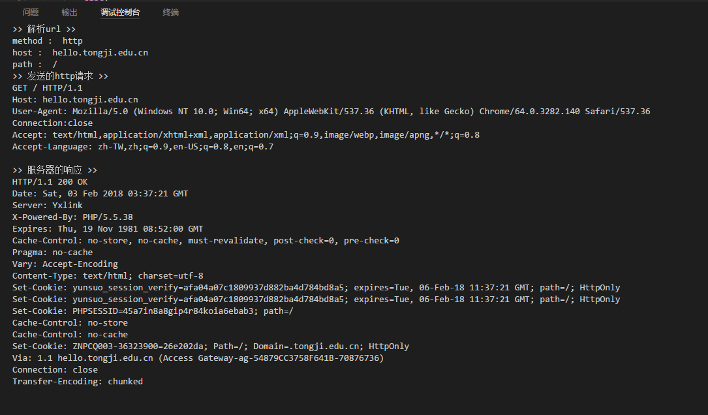

## http_tool 

最近在学习http，写一个小工具，可以发送http请求，解析server的相应，希望能够帮助她更好的学习。不知道取一个什么名字，就先叫http_tool吧。

## http_tool的功能
    1. 发送一个http的get请求 

    2. 显示自己请求get

    3. 显示服务器的相应

    4. 支持post请求

## update :
    1. demo1.py 实现的http协议的发送get请求和解析相应，但是不支持https 
    
    2. demo2.py 支持了https 同时 也支持了发送post请求和解析相应的相应 
    
    3. sample_server.py 是一个flask的server 用来测试 get和post请求的相应

## other ： 

    版本 ： python 3.5.4

## 效果：

