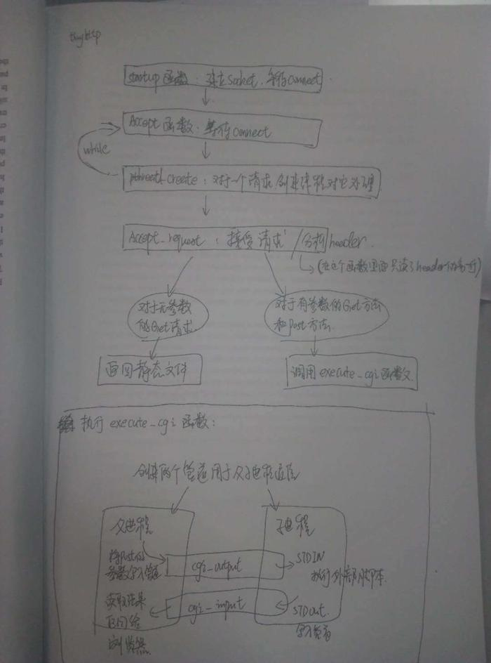

# tinyhttpd

tinyhttp是一个简单的web服务器，实现了web服务器的基本原理。代码全部使用C语言开发，阅读代码，可以了解web服务器的基本原理。

### 目录结构
    1. tinyhttpd_src 文件夹里面是源码

    2.  
        rebuild_mytinyhttpd 是我看源码的加上的注释和打算rebuild的代码
        
        里面的所有的文件都是以test+序号的方式来命令的。
        
        里面的test3.c 是基本上看完了源码，并且加上了注释。rebuild的版本还在写.

    3. 
        对源码的分析和理解，要写的东西比较多，就写在博客上面了
        http://www.jianshu.com/p/18cfd6019296

### 框架

下图是看源码的时候，手画的一个流程图，好像确实有点丑，逃~

