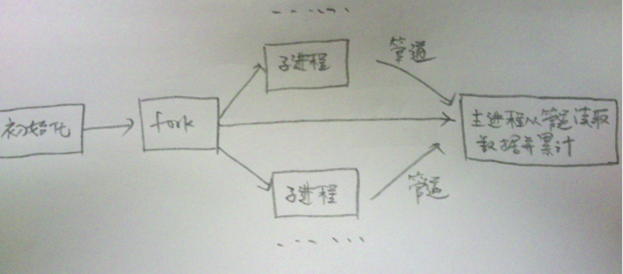

# WebBench

### what is WebBench ?
    Webbench是一个在linux下使用的网站压测工具。它使用fork()模拟多个客户端同时访问我们设定的URL，测试网站在压力下工作的性能，最多可以模拟3万个并发连接去测试网站的负载能力,个人感觉要比Apache自带的ab压力测试工具好。

### 框架
    socket(); 函数　负责根据url和端口建立一个socket链接
    
    build_request(const char *url);　构建一个http请求

    usage(void)；　main函数和usage函数负责根据命令行的输入读取参数

    bench(); 　 负责创建子进程和管道，子进程讲自己的结果写入管道，父进程取读取管道

    benchcore()；  负责调用socket进行发送http请求，里面有一个定时器，时间到的时候，调出死循环，子进程将结果写入管道

### 实现的思路

    父进程创建出n个子进程（参数可以指定）

    这些子进程去创建socket，和server建立连接，发送http请求

    父子进程之间通过管道来通信（统计发送的http的请求的个数和收到的相应）

    Q : 如果结束?

    A : 程序制定了一个timer，表示压测的时间，时间到了，发送信号。然后进程收到信号之后，结束循环。

### 如下图所示：

